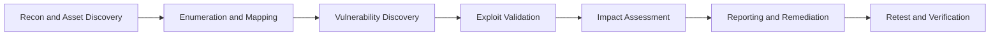

<div align="center">
  
</div>

<div align="center">
  
</div>

<p align="center">
  
  
  
  
</p>

<p align="center">
  
  
  
</p>

---

## root@msu:~# whoami

```bash
msu@root:~$ id
name: Muhammad Sudais Usmani
focus: Offensive Security, Bug Bounty Hunting (BBH), Exploit Development, Security Research
mission: Build, break, validate, and secure real-world systems
method: Attacker mindset + engineering discipline + practical remediation
```

I work at the intersection of offensive security and software engineering. My approach is to simulate realistic adversarial behavior, verify exploitability with technical depth, and deliver remediation guidance that engineering teams can apply quickly.

---

## Role Matrix

| Role | What I Do | Primary Outputs |
|---|---|---|
| Offensive Security Engineer | Conduct offensive assessments against applications, services, and infrastructure | Attack surface reports, validated findings, risk-ranked remediation |
| Bug Bounty Hunter (BBH) | Hunt real-world vulnerabilities across in-scope targets with responsible disclosure | Accepted reports, impact PoCs, secure remediation recommendations |
| Exploit Developer | Build proof-of-concepts and exploit chains for confirmed vulnerabilities | Exploit PoCs, reproducible test cases, impact demonstrations |
| Security Researcher | Investigate vulnerability classes, tooling, and offensive techniques | Research notes, custom scripts, technical write-ups |
| Cyber Security Analyst | Analyze threats, suspicious behavior, and defensive gaps | Incident notes, detection recommendations, hardening controls |
| MERN Stack Developer | Design and build full-stack web applications with secure patterns | APIs, dashboards, secure auth flows, production-ready features |
| Linux Administrator | Manage Linux environments, networking, permissions, and hardening | Reliable systems, hardened baselines, automation scripts |
| CTF Player | Practice advanced exploitation and problem-solving under time pressure | Faster triage, improved exploit intuition, repeatable attack workflows |

---

## Offensive Security Domains

- Web application security testing (OWASP Top 10 + logic flaws)
- API security testing (auth bypass, IDOR, rate-limit, data exposure)
- Authentication and session management weakness analysis
- Privilege escalation path analysis (application and host level)
- Exploitability validation and impact proofing
- Secure-by-design recommendations for engineering teams

---

## BBH Mission Control

| BBH Stage | What I Execute | Outcome |
|---|---|---|
| Scope Intelligence | Parse scope policy, map in-scope assets, prioritize critical targets | Clear target list and risk-driven testing order |
| Recon Expansion | Subdomain/endpoint discovery, tech fingerprinting, trust map creation | Broad visibility across exposed attack surface |
| Deep Testing | Manual vulnerability testing on auth, business logic, access control, and API flows | High-confidence, reproducible findings |
| Controlled Exploitation | Build PoC with minimum-risk payload to demonstrate impact | Validated severity with concrete proof |
| Reporting and Triage Support | Write complete report with root cause and realistic remediation path | Faster program triage and acceptance rates |
| Retest and Variant Analysis | Verify patch and probe for sibling vulnerabilities | Durable fixes and reduced repeat risk |

### BBH Priority Finding Classes

| Priority | Vulnerability Class | Typical Impact |
|---|---|---|
| P1 | Broken Access Control / IDOR | Unauthorized data access or account takeover |
| P1 | Authentication / Session Bypass | Privilege takeover and persistent compromise |
| P1 | High-Impact SSRF / RCE | Internal pivoting or command execution |
| P2 | Stored / Reflected XSS in Sensitive Context | Session theft, action forgery, and user compromise |
| P2 | Business Logic Abuse | Fraud, quota bypass, or workflow manipulation |
| P3 | Security Misconfiguration | Increased attack surface and chained exploitation risk |

---

## Exploit Development Track

| Track | Method | Tooling | Deliverable |
|---|---|---|---|
| Web Exploit Chaining | Chain multiple medium findings into critical impact path | Burp Suite, custom scripts, browser dev tools | End-to-end exploit path with reproducible steps |
| API Exploit Development | Abuse object-level auth and weak validation in REST endpoints | Postman, Burp, jq, curl, Python | API exploit PoC with request/response evidence |
| Local Privilege Escalation | Enumerate kernel/service/config weaknesses and pivot privileges | LinPEAS, Linux tooling, manual checks | Privilege escalation proof and hardening controls |
| Binary Exploit Learning | Analyze low-level behavior and crash conditions in lab targets | GDB, pwndbg, objdump, checksec | Research notes and exploit development progression |
| Exploit Reliability | Improve PoC stability and cleanup for repeatable testing | Bash/Python automation, containerized labs | Reliable exploit workflow for validation and retest |

### Exploit Dev Toolkit
<p>
  
  
  
  
  
  
</p>

---

## Offensive Workflow (Execution Model)



### Phase Details

1. Recon and asset discovery
   - Subdomain enumeration, endpoint mapping, technology fingerprinting.
2. Enumeration and mapping
   - Service-level checks, auth flow mapping, trust boundary identification.
3. Vulnerability discovery
   - Automated and manual testing for high-confidence findings.
4. Exploit validation
   - Build PoC only when authorized and required for impact proof.
5. Impact assessment
   - Map business impact, technical severity, and attack preconditions.
6. Reporting and remediation
   - Clear reproduction steps + practical fixes + validation criteria.
7. Retest and verification
   - Confirm closure and detect related variants.

---

## Security Arsenal

### Recon and Enumeration
<p>
  
  
  
  
  
</p>

### Web and Exploitation
<p>
  
  
  
  
  
</p>

### Forensics and Analysis
<p>
  
  
  
  
</p>

### Password and Access Testing
<p>
  
  
  
</p>

### BBH and Platforms
<p>
  
  
  
  
</p>

### Tool Usage Matrix

| Category | Primary Tools | Usage in Workflow |
|---|---|---|
| Recon and Discovery | Nmap, Subfinder, Amass, Gobuster, Shodan | Expand and prioritize attack surface |
| Web Testing | Burp Suite, OWASP ZAP, Nuclei, Nikto | Detect and validate web vulnerabilities |
| API Testing | Postman, Burp Repeater, curl, jq | Validate auth controls and object-level access |
| Exploitation | Metasploit, SQLMap, custom Python/Bash PoCs | Demonstrate exploitability and impact |
| Credential Security | Hashcat, Hydra, John the Ripper | Assess password policy and auth resilience |
| Traffic and Forensics | Wireshark, tcpdump, Autopsy, ExifTool | Analyze network behavior and evidence artifacts |
| OSINT and Intel | Shodan, Censys, passive DNS sources | Gather contextual intelligence for targeting |
| Linux Operations | Bash, systemd tools, iptables, OpenSSH | Harden hosts and automate secure operations |
| Reporting and Validation | Markdown templates, screenshots, retest scripts | Deliver clear findings and verify remediation |

---

## Development and Engineering Stack

<p align="left">
  
</p>

### Python Ecosystem
<p align="left">
  
  
  
  
  
  
  
  
</p>

### Security Stack
<p align="left">
  
  
  
  
  
  
  
  
</p>

### Development Focus

- Build secure MERN applications with strong auth and session controls.
- Integrate validation, error handling, and secure defaults at API level.
- Use Linux-first tooling and scripts to automate testing workflows.
- Maintain developer velocity without reducing security coverage.

---

## Projects and Research Tracks

| Project / Track | Focus Area | Status |
|---|---|---|
| WebDevSec Pro+ | Automated web security assessment pipeline | Ongoing |
| Pay4XSS | Vulnerability exploitation workflow experiments | Ongoing |
| WordPress Vulnerability Scanner | CMS-focused security testing tool | Completed |
| BugHunter Linux | Security research Linux environment | Completed |
| Advanced OSINT Framework | Recon and intelligence collection toolkit | Completed |
| Custom Linux Kernel Security Track | Performance + security experimentation | Planned |

---

## Security and CTF Profiles

[](https://app.hackviser.com/profile/h0x4bug)
[](https://flagyard.com/profile/Bl4ckPh4nt0m)

CTF focus areas:
- Web exploitation and logic flaws
- Enumeration speed and payload adaptation
- Privilege escalation and lateral movement fundamentals
- Realistic attack path chaining from low-risk to critical impact

---

## Certifications

| Certification | Domain | Status |
|---|---|---|
| CEH | Ethical Hacking and Offensive Security | Achieved |
| CCEP - Certified Cybersecurity Educator Professional | Security Education and Knowledge Transfer | Achieved |
| ISO/IEC 27001 | Information Security Management | Achieved |
| AWS Security Incident Response | Cloud Incident Handling | Achieved |
| CAPenX (Mock) | Application Penetration Testing | Achieved |
| CRPO - Certified Ransomware Protection Officer | Ransomware Defense and Response | Achieved |

---

## GitHub Analytics

<p align="center">
  
  
</p>

<p align="center">
  
  
</p>

<p align="center">
  
</p>

---

## GitHub Achievements

<p align="center">
  <a href="https://github.com/TheBl4ckPh4nt0m?achievement=yolo&tab=achievements">
    
  </a>
  <a href="https://github.com/TheBl4ckPh4nt0m?achievement=quickdraw&tab=achievements">
    
  </a>
  <a href="https://github.com/TheBl4ckPh4nt0m?achievement=pull-shark&tab=achievements">
    
  </a>
</p>

| Achievement | Link |
|---|---|
| YOLO | https://github.com/TheBl4ckPh4nt0m?achievement=yolo&tab=achievements |
| Quickdraw | https://github.com/TheBl4ckPh4nt0m?achievement=quickdraw&tab=achievements |
| Pull Shark | https://github.com/TheBl4ckPh4nt0m?achievement=pull-shark&tab=achievements |

---

## Connect

[](https://linkedin.com/in/muhammad-sudais-usmani-950889311)
[](https://medium.com/@msusuport)
[](https://www.instagram.com/usmanisudais/)

---

## Ethics and Authorization Policy

All offensive security activities are performed only in authorized environments and within legal boundaries. Any testing, exploit development, or simulation work is conducted for defensive improvement, security validation, and risk reduction.
